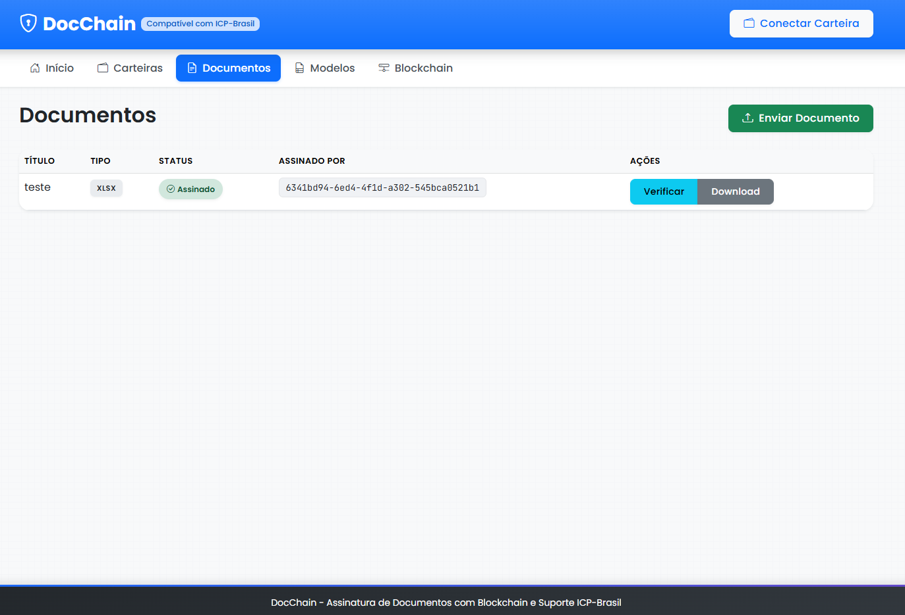
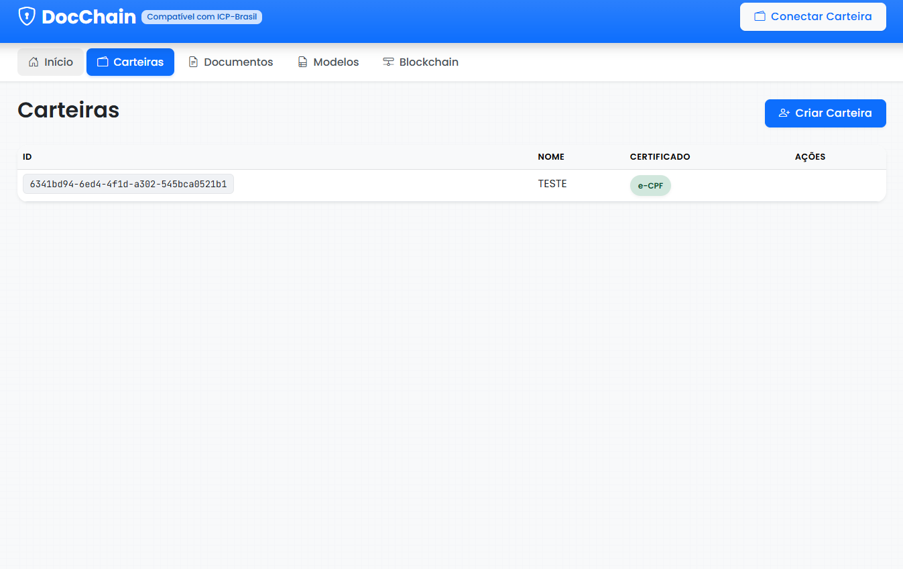
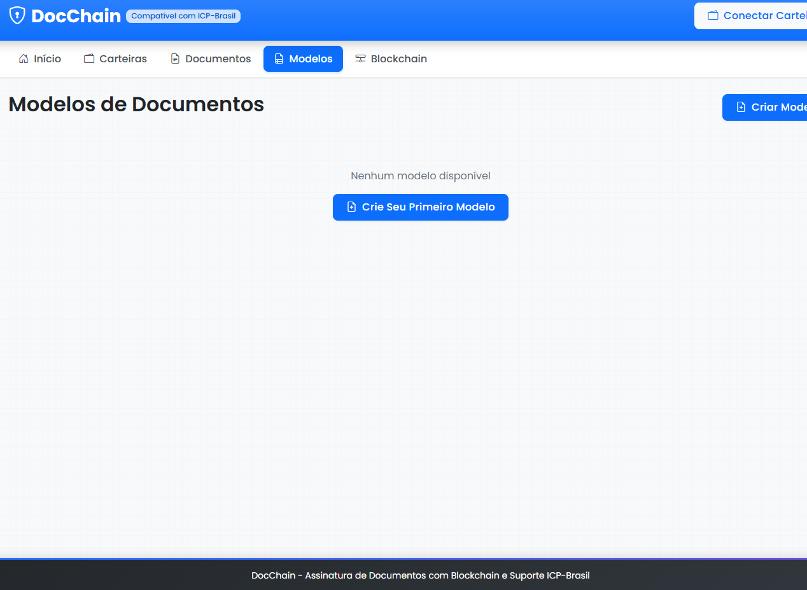
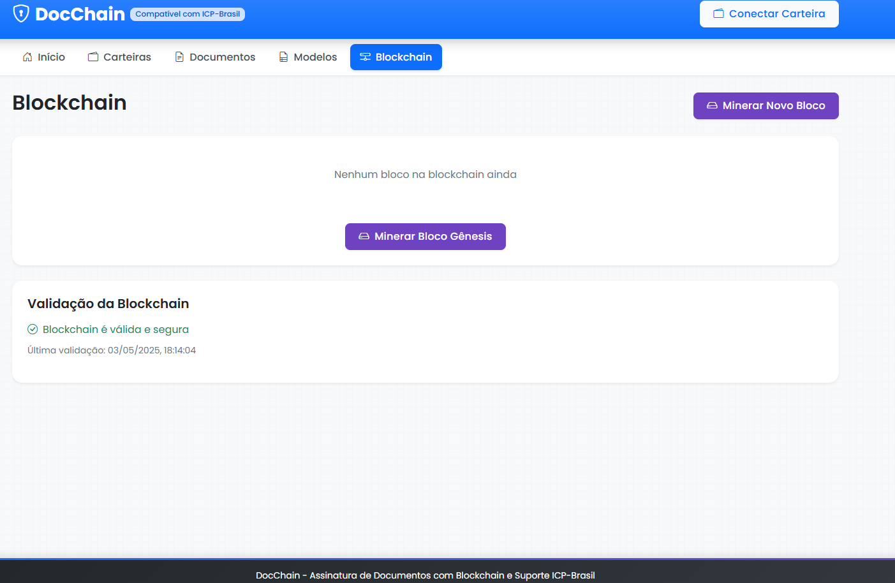
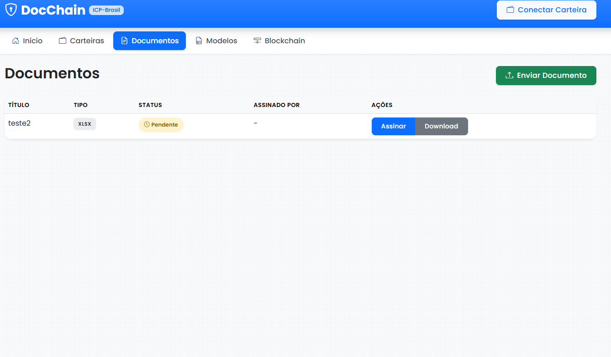
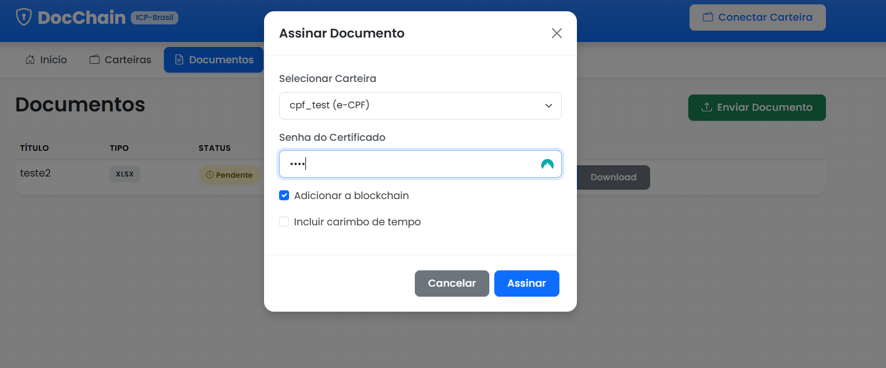

# DocChain

A blockchain-based document signing system with ICP-Brasil compliance.








## Overview

DocChain is a secure document signing platform that combines blockchain technology with ICP-Brasil digital certificates to provide legally valid document signatures with immutable proof of existence and integrity.

## Features

- **Document Signing**: Sign documents using digital certificates compliant with ICP-Brasil  
- **Blockchain Integration**: Store document hashes and signature information on a blockchain for immutability  
- **Certificate Management**: Create and manage digital certificates  
- **Signature Verification**: Verify document signatures and their records on the blockchain  
- **Revocation Check**: Verify certificate revocation status via CRL and OCSP  
- **Timestamp Authority**: Optional timestamps via TSA  
- **Database Storage**: Persistent storage of documents, signatures, and wallets using SQLite  
- **Portuguese Interface**: Fully localized user interface in Brazilian Portuguese  

## Architecture

The application consists of:

- **Backend**: Go-based API server with blockchain and cryptography modules  
- **Frontend**: Web interface using HTML/CSS/JavaScript  
- **CLI**: Command-line interface for all operations  
- **Database**: SQLite for persistent data storage  

## Technical Stack

- **Backend**: Go (Golang)  
- **Frontend**: HTML5, CSS3, JavaScript, Bootstrap 5  
- **Blockchain**: Custom implementation with Proof of Work  
- **Cryptography**: CMS/PKCS#7 for signatures, SHA-256 for hashing  
- **API**: RESTful JSON API  
- **Database**: SQLite  

## Getting Started

### Prerequisites

- Go 1.18 or higher  
- Git  

### Installation

1. Clone the repository:
   ```
   git clone https://github.com/raykavin/docchain.git
   cd docchain
   ```

2. Build the application:
   ```
   go build -o docchain ./cmd/server
   ```

3. Run the server:
   ```
   ./docchain
   ```

4. Access the web interface at http://localhost:8080

### Using the ICP-Brasil Example

The ICP-Brasil example can be run in two ways:

```
# Start the web server
go run examples/icpbrasil/main.go server

# Run the demo with a document and certificate
go run examples/icpbrasil/main.go demo <document_path> <certificate_path> <certificate_password>
```

### Using the CLI

The CLI provides access to all features:

```
# Create a new wallet
./docchain wallet create --name "My Wallet"

# Sign a document
./docchain document sign --file document.pdf --wallet my-wallet-id

# Mine a new block
./docchain blockchain mine
```

## ICP-Brasil Compliance

DocChain implements the following ICP-Brasil requirements:

- Support for A1 certificates (.pfx/.p12)  
- Detached CMS/PKCS#7 signatures  
- Full certificate chain inclusion  
- Timestamp Authority integration  
- Revocation checking via CRL and OCSP  


## 🤝 Contributing

Contributions to BackNRun are welcome! Here are some ways you can contribute:

1. Report bugs and suggest features by opening issues
2. Submit pull requests with bug fixes or new features
3. Improve documentation
4. Share your custom strategies with the community

## 📄License

MIT License © [Raykavin Meireles](https://github.com/raykavin)

BackNRun is licensed under the MIT License. See the [LICENSE](LICENSE.md) file for details.

---
## 📬 Contact

Feel free to reach out for support or collaboration:  
**Email**: [raykavin.meireles@gmail.com](mailto:raykavin.meireles@gmail.com)  
**GitHub**: [@raykavin](https://github.com/raykavin)\
**LinkedIn**: [@raykavin.dev](https://www.linkedin.com/in/raykavin-dev)\
**Instagram**: [@raykavin.dev](https://www.instagram.com/raykavin.dev)